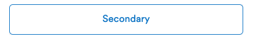
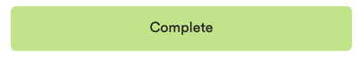
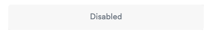
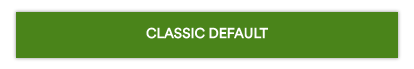
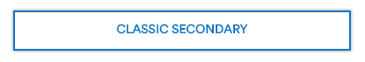
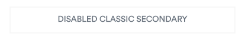

[](https://travis-ci.org/AlaskaAirlines/OrionStatelessComponents__ods-button)


# \<ods-button>

\<ods-button> is a wrapper component for a HTML \<button> element containing styling and behavior.

## Docs

All information regarding Project Setup, Technical Details, Tests and information regarding ODS Stateless Components can be found in the [./docs](https://github.com/AlaskaAirlines/OrionStatelessComponents__docs) repository.

## Install

```shell
$ npm i @alaskaairux/ods-button
```

### Design Token CSS Custom Property dependency

The use of any ODS Component has a dependency on the [ODS Design Tokens (npm install)](https://www.npmjs.com/package/@alaskaairux/orion-design-tokens). See repository and API information [here](https://github.com/AlaskaAirlines/OrionDesignTokens).

For additional details in regards to using Orion Design Tokens with components, please see [./docs/TECH_DETAILS.md](https://github.com/AlaskaAirlines/OrionStatelessComponents__docs/blob/master/docs/TECH_DETAILS.md)

### CSS Custom Property fallbacks

CSS Custom Properties are not supported in older browsers. For this, fallback properties are pre-generated and included with the npm. Any update to the Orion Design Tokens will be immediately reflected with browsers that support CSS Custom Properties, legacy browsers will require updated components with pre-generated fallback properties.

### Define dependency in project component

Define the component dependency within each component that is using the \<ods-button> component.

```javascript
import "@alaskaairux/ods-button";
```

**Reference component in HTML**

```html
<ods-button>Hello World</ods-button>
```

## Element \<ods-button>

```javascript
class OdsButton extends LitElement
```

### Styling

Option(s) for component customization

| Selector | Type | State | Description |
|----|----|----|---|
| ::part() | pseudo-element | experimental | Update shadowDOM CSS from outside the component; see [./docs/CSS_CUSTOMIZATION.md](/docs/CSS_CUSTOMIZATION.md) |

### Button use cases

The \<ods-button> element should be used in situations where users may:

* submit a form
* begin a new task
* trigger a new UI element to appear on the page
* specify a new or next step in a process

### Buttons are not Hyperlinks

In cases were the action of the button would not fit the criteria above, it is most likely a Hyperlink. In that situation it is recommended that the \<ods-hyperlink> element be used with options of `role=button` configuration for visual appearance over functional use.

### Responsive support

The \<ods-button> element by default will fill 100% of the space given within an outer element.

If the desired appearance of the \<ods-button> is to responsive within a given space, then the use of the `responsive` attribute is required on the \<ods-element>.

If the desired appearance of the \<ods-button> is to be placed in the reverse direction of natural content, then the attributes of `responsive` and `reverse` are needed on the \<ods-button> element.

### Multiple buttons

When the UI requires the use of multiple buttons within the same space, with the use of the [Orion Web Core Style Sheets](https://alaskaairlines.github.io/OrionWebCoreStyleSheets/#ods-utility-css-.ods-containedButtons), and the `ods-containedButtons` selector will lay out the buttons in the space without any additional effort.

```html
<div className="ods-containedButtons">
  <ods-button>Default</ods-button>
  <ods-button condensed>Condensed</ods-button>
  <ods-button isactive>Active</ods-button>
  <ods-button disabled>Disabled</ods-button>
</div>
```

In addition, using the `ods-containedButtons--reverse` selector will move the layout of the buttons to the opposite side of the view.

```html
<div className="ods-containedButtons ods-containedButtons--reverse">
  <ods-button>Default</ods-button>
  <ods-button condensed>Condensed</ods-button>
  <ods-button isactive>Active</ods-button>
  <ods-button disabled>Disabled</ods-button>
</div>
```

### Theme support

\<ods-button> supports both Orion and Classic themes. Default, and secondary type, and disabled state supports the Classic theme. Flow type options are NOT supported by the Classic theme.

### Properties:

| Attribute | Value type | Description |
|----|----|----|
| arialabel | string | Populates the `aria-label` attribute that is used to define a string that labels the current element. Use it in cases where a text label is not visible on the screen. If there is visible text labeling the element, use `aria-labelledby` instead. |
| arialabelledby | string | Populates the `aria-labelledby` attribute that establishes relationships between objects and their label(s), and its value should be one or more element IDs, which refer to elements that have the text needed for labeling. List multiple element IDs in a space delimited fashion. |
| autofocus | boolean | This Boolean attribute lets you specify that the button should have input focus when the page loads, unless the user overrides it |
| buttontype | string | Type of button defines the visual styling. <br/>Option(s): `primary`, `secondary`. Default value is `primary`. |
| condensed | boolean | Reduces left/right padding to fit button in condensed spaces |
| disabled | boolean | If set to true button will become disabled and not allow for interactions. <br/>Default value is `false`. |
| flowtype | string | Sets display type to represent the flow options. Options: `complete`
| form | string | The form element that the button is associated with (its form owner). The value of the attribute must be the id attribute of a `<form>` element in the same document |
| formaction | string | Specifies the URL of the file that will process the input control when the form is submitted. The formaction attribute overrides the `action` attribute of the `<form>` element |
| formenctype| string | If the button is a submit button, this attribute specifies the type of content that is used to submit the form to the server. |
| formmethod | string | If the button is a submit button, this attribute specifies the HTTP method that the browser uses to submit the form. |
| formnovalidate | boolean | If the button is a submit button, this Boolean attribute specifies that the form is not to be validated when it is submitted. If this attribute is specified, it overrides the novalidate attribute of the button's form owner. |
| formtarget | string | If the button is a submit button, this attribute is a name or keyword indicating where to display the response that is received after submitting the form. Options: `_self`, `_blank`, `_parent`, `_top:` |
| id | string | Set the unique ID of an element. |
| isactive | boolean | If set to true button will appear in active state. <br/>Default value is `false`. |
| name | string | The name of the button, which is submitted with the form data. |
| responsive | boolean | Sets the UI of the button to be responsive within its given container. |
| reverse | boolean | Required to be paired with `responsive`, but sets the placement in the reverse direction of natural content. |
| svgIconLeft | string | Pass in SVG string for icon to appear on the LEFT |
| svgIconRight | string | Pass in SVG string for icon to appear on the RIGHT |
| title | string | Sets title attribute. The information is most often shown as a tooltip text when the mouse moves over the element. |
| theme | string | Sets theme of element; option: `classic` |
| type | string | The type of the button. Possible values are: `submit`, `reset`, `button` |
| value | string | Defines the value associated with the button which is submitted with the form data. |

### API Code Examples


```html
<ods-button>default</ods-button>
```



```html
<ods-button buttontype="secondary">secondary</ods-button>
```


```html
<ods-button isactive>is active</ods-button>
```



```html
<ods-button flowtype="complete"> complete </ods-button>
```



```html
<ods-button disabled>disabled</ods-button>
```



```html
<ods-button theme="classic">classic default</ods-button>
```



```html
<ods-button buttontype="secondary" theme="classic">classic secondary</ods-button>
```



```html
<ods-button disabled buttontype="secondary" theme="classic">disabled classic secondary</ods-button>
```

### Contextual component

A special case scenario for responsiveness. The \<ods-button> element is built to handle responsive situations when it is the only element within a block. If the \<ods-button> element is used within context of another element, then it's the responsibility of the parent element to dictate the responsiveness of the \<ods-element>.

In this scenario, simply set the `context` of the element to be `true`.

```html
<ods-button context="true">Default state; context true</ods-button>
```

## Alternate build solutions

Why would you need this? With all Orion custom elements the CSS for the element is embedded within the shadow DOM of the custom element. If your development environment is not allowing for the use of shadow DOM elements, the CSS for each element is distributed via additional resources within the npm package.

[Read more about how to use alternate CSS build resources](https://github.com/AlaskaAirlines/OrionStatelessComponents__docs/blob/master/docs/ALT_BUILD.md)

## Development

In order to develop against this project, if you are not part of the core team, you will be required to fork the project prior to submitting a pull request.

Please be sure to review the [contribution guidelines](.github/CONTRIBUTING.md) for this project. Please make sure to **pay special attention** to the [conventional commits](.github/CONTRIBUTING.md#conventional-commits) section of the document.

### Start development environment

Once the project has been cloned to your local resource and you have installed all the dependencies you will need to open three different shell sessions. One is for the Gulp tasks, the second is for a series of npm tasks and the last is to run the Polymer server.

```shell
// shell terminal one
$ gulp dev

// shell terminal two
$ npm run dev

// shell terminal three
polymer serve
```

##

<footer>
Alaska Airlines Orion Design System<br>
Copyright 2019 Alaska Airlines, Inc. or its affiliates. All Rights Reserved.
</footer>
